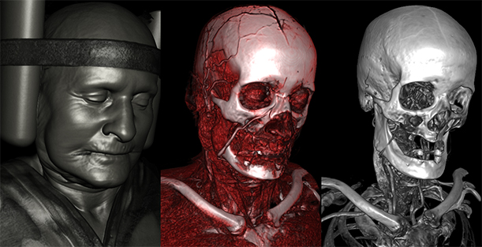

## VIZE - Interactive Volume Visualization

For an introduction to this project watch: https://youtu.be/EEhfCa1iP8k (Portuguese only)

### Features
- Exclusive interactive visualization mode with ray casting and MPR simultaneously;
- Supports DICOM and TIFF images;
- Histogram visualization;
- Intuitive transfer function editor;
- GPU implementation with GLSL;
- Code:
	- Modern C++;
	- Modern OpenGL;
	- 100% open source!

------------

### How To Build (in Windows)

#### 1. Download and install the required softwares
1. **Git**: https://git-scm.com/downloads
2. **Visual Studio Community**: https://visualstudio.microsoft.com/
3. **CMake**: https://cmake.org/download/

#### 2. Download and install the dependencies

1. **Boost**:
https://sourceforge.net/projects/boost/files/boost-binaries/1.71.0/boost_1_71_0-msvc-14.2-64.exe/download (suggested version)

2. **Qt**:
https://download.qt.io/archive/qt/5.13/5.13.2/qt-opensource-windows-x86-5.13.2.exe (suggested version)

#### 3. Set the environment variables

In order for **CMake** to correctly find the libraries installed in the previous step (**Boost** e **Qt**), you must set the following environment variables on your system:

1. **QTDIR**: {PathToWhereYouHaveInstalledQt}\5.13.2\msvc2017_64
2. **BOOST_INCLUDEDIR**: {PathToWhereYouHaveInstalledBoost}
3. **BOOST_LIBRARYDIR**: {PathToWhereYouHaveInstalledBoost}\lib64-msvc-14.2
4. **BOOST_ROOT**: {PathToWhereYouHaveInstalledBoost}\boost

#### 4. Clone the repository

git clone git@github.com:oprogramadorreal/vize.git

#### 5. Generate the Visual Studio project

To generate the Visual Studio solution for this project using CMake, simply run the ** build-vc16-win64.bat ** script which is in *vize/build/*.

Doing so will generate the **vize.sln** file in *vize/build/vc16-win64/*. Done! Now, just open it with Visual Studio and build the solution.